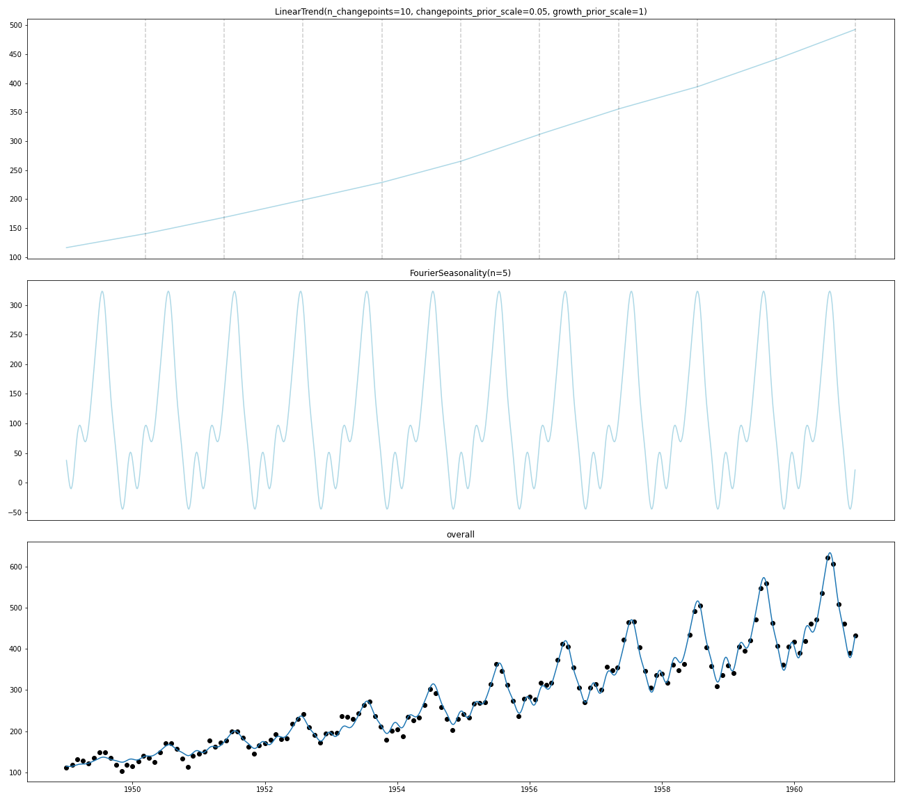

# TimeSeers

> seers - (Noun) plural form of seer - A person who foretells future events by or as if by supernatural means

TimeSeers is an hierarchical Bayesian Time Series model based on [Facebooks Prophet](https://facebook.github.io/prophet/), written in PyMC3.

The goal of the TimeSeers project is to provide an easily extensible alternative to Prophet for timeseries modelling when
multiple time series are expected to share parts of their parameters.
 
 
## Usage
TimeSeers is designed as a language for building time series models. It offers a toolbox of various components which
can be arranged in a formula. We can compose these components in various ways to best fit our problem. 

TimeSeers strongly encourages using uncertainty estimates, and will by default use MCMC to get full posterior estimates.


```python
from timeseers import LinearTrend, FourierSeasonality
import pandas as pd

model = LinearTrend() + FourierSeasonality(period=pd.Timedelta(days=365)) + FourierSeasonality(period=pd.Timedelta(days=365))
model.fit(data[['t']], data['value'])
```

### Multiplicative seasonality
```python
from timeseers import LinearTrend, FourierSeasonality
import pandas as pd

passengers = pd.read_csv('AirPassengers.csv').reset_index().assign(
    t=lambda d: pd.to_datetime(d['Month']),
    value=lambda d: d['#Passengers']
)

model = LinearTrend(n_changepoints=10) * FourierSeasonality(n=5, period=pd.Timedelta(days=365))
model.fit(passengers[['t']], passengers['value'], tune=2000)

model.plot_components(X_true=passengers, y_true=passengers['value']);
```

    Auto-assigning NUTS sampler...
    Initializing NUTS using jitter+adapt_diag...
    Multiprocess sampling (4 chains in 4 jobs)
    NUTS: [sigma, beta, m, delta, k]
    Sampling 4 chains, 0 divergences: 100%|██████████| 10000/10000 [00:57<00:00, 173.30draws/s]





# Contributing

PR's and suggestions are always welcome. Please open an issue on the issue list before submitting though in order to
avoid doing unnecessary work. I try to adhere to the `scikit-learn` style as much as possible. This means:

- Fitted parameters have a trailing underscore
- No parameter modification is done in `__init__` methods of model components

